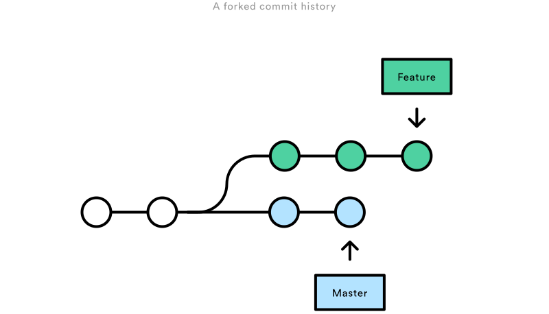
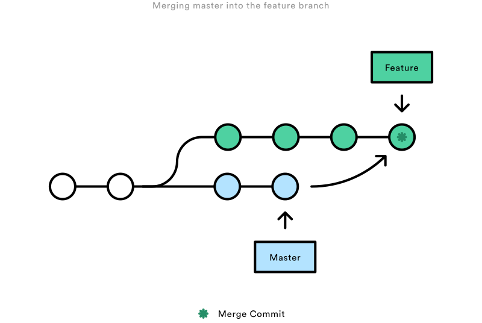
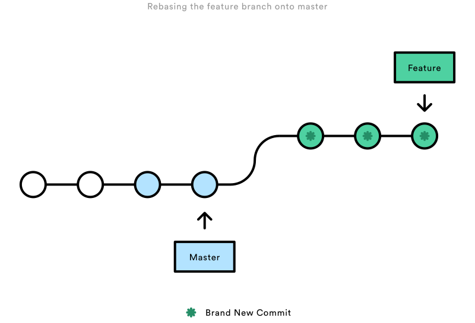
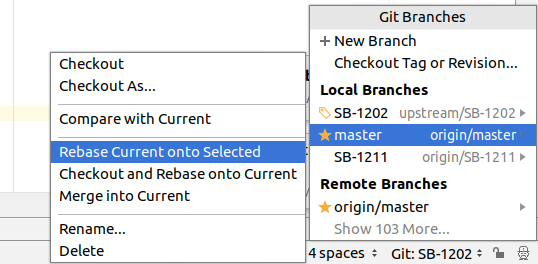

# Git rebase vs merge

## Conceptual Overview

The first thing to understand about `git rebase` is that it solves the same problem as git merge. Both of these commands 
are designed to integrate changes from one branch into another branch—they just do it in very different ways.  

Consider what happens when you start working on a new feature in a dedicated branch, then another team member updates 
the `master` branch with new commits. This results in a forked history, which should be familiar to anyone who has used 
Git as a collaboration tool.



Now, let’s say that the new commits in `master` are relevant to the feature that you’re working on. To incorporate the 
new commits into your `feature` branch, you have two options: `merging` or `rebasing`.  

## The Merge Option

??? danger "Please avoid using this option!"
    Please avoid using this option. It creates unnecessary noise in your PRs and makes it ***extremely*** hard to 
    follow your real changes. We have included this information because it will give you better understanding of why we 
    prefer `rebasing` over `merging`.

The easiest option is to merge the `master` branch into the feature branch using something like the following:

```
git checkout feature
git merge master
```

Or, you can condense this to a one-liner:

```
git merge feature master
```

This creates a new “merge commit” in the feature branch that ties together the histories of both branches, giving you a 
branch structure that looks like this:



Merging is nice because it’s a ***non-destructive*** operation. The existing branches are not changed in any way. This 
avoids all of the potential pitfalls of rebasing (discussed below).  

On the other hand, this also means that the `feature` branch will have an extraneous merge commit every time you need to 
incorporate upstream changes. If `master` is very active, this can pollute your feature branch’s history quite a bit. 
While it’s possible to mitigate this issue with advanced git log options, it can make it **hard** for other developers 
to understand the history of the project or branch you are working on.

## The Rebase Option

!!! success "We prefer this option over `merging`"

As an alternative to merging, you can rebase the feature branch onto master branch using the following commands:

```
git checkout feature
git rebase master
```

This moves the entire `feature` branch to begin on the tip of the master branch, effectively incorporating all of 
the new commits in `master`. But, instead of using a `merge` commit, `rebasing` re-writes the project history by 
creating brand new commits for each commit in the original branch.




The major benefit of rebasing is that you get a much cleaner project history:

* First, it eliminates the unnecessary merge commits required by `git merge`
* Second, as you can see in the above diagram, rebasing also results in a perfectly linear project history — you can 
  follow the tip of feature all the way to the beginning of the project without any forks
  
This makes it easier to navigate your project with commands like `git log`, `git bisect`, and `gitk`.

### The Golden rule of Rebasing

So, before you run `git rebase`, always ask yourself, “Is anyone else looking at this branch?”. If the answer is yes, 
take your hands off the keyboard and start thinking about a non-destructive way to make your changes. 
Otherwise, you’re safe to re-write history as much as you like.


### Force-Pushing

If you try to push the rebased `feature` branch back to a remote repository, Git will prevent you from doing so because 
it conflicts with the remote `feature` branch. But, you can force the push to go through by passing the `--force` flag, 
like so:

```
# Be very careful with this command!
git push --force origin feature
```

However, before executing this command, please be **sure** nobody else is working on this branch.


## But how do I rebase?

Before you start, it is a good idea to backup your current project. If this is your first time doing a rebase, you can 
screw things up and loose/damage the work you've already done. So better safe, than sorry. (If you are a pro - what are
you even doing here? :smile: )  
  

### Syncing your fork first

You need to keep your fork's `master` branch in sync with the `upstream/master`. This is also required 
for rebasing as you will be pointing your `feature` branch to the `HEAD` of the forked `master` branch. 
If your fork's `master` is off sync with the `upstream/master` and you rebase - it will likely create a mess.  

Steps: 

* Make sure you are on the `master` branch (`git checkout master`)
* Add `upstream` remote which points to `https://github.com/strongbox/strongbox`   
  ```linenums="1"
  $ git remote add upstream git@github.com:strongbox/strongbox.git
  $ git remote -v
    origin  	git@github.com:your-username/strongbox.git (fetch)
    origin  	git@github.com:your-username/strongbox.git (push)
    upstream	git@github.com:strongbox/strongbox.git (fetch)
    upstream	git@github.com:strongbox/strongbox.git (push)
  ```

* Sync your fork   
  ```linenums="1"
   git fetch upstream
   git merge upstream/master
   git push origin master
  ```
  
At this point, your fork should be in sync with the upstream. You can validate that by going to your fork in github.
It should now be saying that master is `even with strongbox:master`.

### Rebasing

#### Idea

In most modern IDEs you will have an option to rebase from the IDE. That would be your best option as you will be able
to more easily resolve any conflicts which might occur during the rebase.

If you are using Intellij Idea, you need to be at your `feature` branch and then just `Rebase current onto Selected (master)`:



What this will do is to rebase the `SB-1202` feature branch onto the `master`.

Should there be any conflicts, Idea will give you a pop-up window with a list of the conflicting files/changes
 
Explanation for the options above:

* `Accept yours` - overwrites the file with your changes
* `Accept theirs` - overwrites the file with the remote changes (if the remote file was deleted, it will be deleted on your branch as well) 
* `Merge` - gives you a window from which you can "merge" the changes as appropriate.

You can also check Idea's manual for [Resolving Conflicts]


#### Command line

If you are command line lover, you can execute the commands manually:

```linenums="1"
git checkout feature-branch
git rebase master
```

However, when conflicts arise, it could be a bit challenging to fix them from your console.

#### Finally

Once you are done rebasing and you have ensured that the code builds as well as the tests are passing, then you will 
need to force push your branch (remember the [Force Pushing](#force-pushing) section?)

```
git push --force origin feature-branch
```

### I need help

We've all been there. If you are having trouble with your `rebase`, you can ask for help in your community channel.

<a href="https://chat.carlspring.org/channel/community" target="_blank">
    
</a>  


## License

This page has borrowed some of the images and parts of the [Atlassian Merging Vs Rebasing] article which
are licensed under [CC BY 2.5 AU]. Head to the [Atlassian Merging Vs Rebasing] article for a more thorough comparison of `merging` vs `rebasing`.

[Atlassian Merging Vs Rebasing]: https://www.atlassian.com/git/tutorials/merging-vs-rebasing
[CC BY 2.5 AU]: https://creativecommons.org/licenses/by/2.5/au/
[Resolving Conflicts]: https://www.jetbrains.com/help/idea/resolving-conflicts.html
