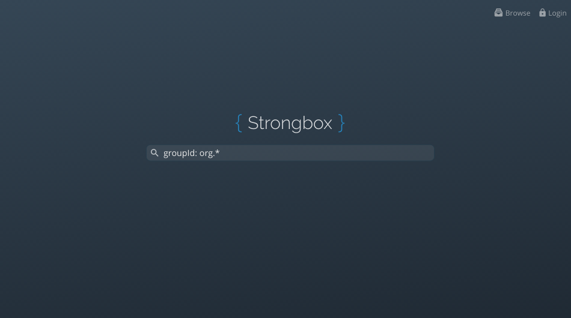
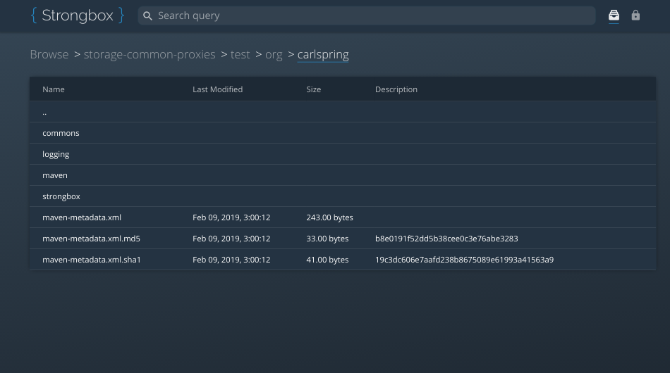
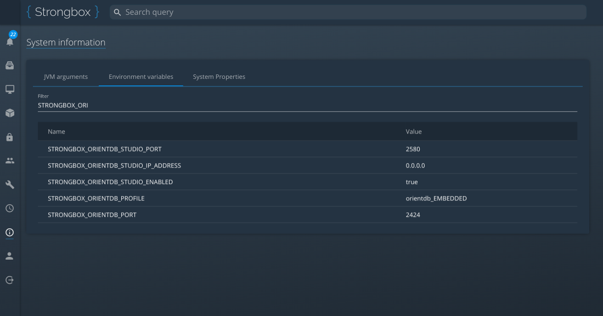
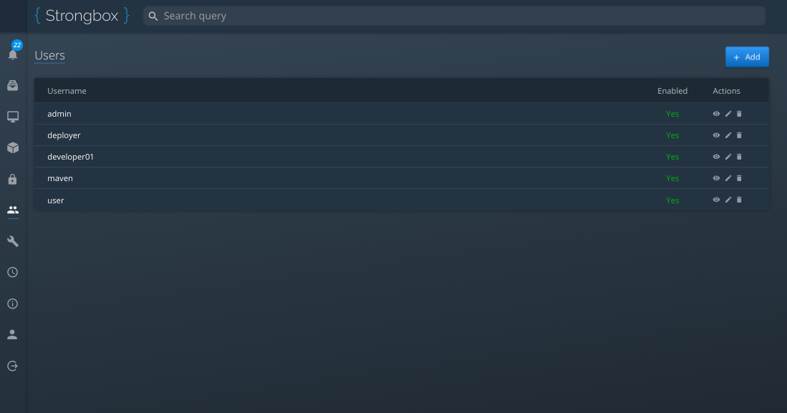
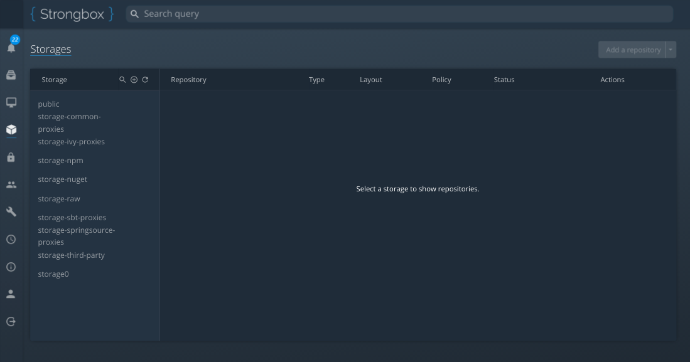

## Strongbox

Strongbox is an OpenSource artifact repository manager written in Java. We aim to provide an easy and reliable platform, 
for hosting your (binary) artifacts, regardless or your repository layout.

## Features 

??? success "Directory browsing"
    We have two types of directory browsing implemented:  

    * [x] `/browse` - browsing via the user interface. 
    * [x] `/api/browse` - API endpoint which returns either `JSON` or very lightweight `HTML` directory listing.

??? success "Cron Tasks"
    
    We have various cron tasks available to automate almost anything like rebuilding metadata, emptying Trash, etc.
    
    * [x] Java implementation
    * [x] Groovy implementation

??? success "Event handling"

    

??? abstract "Logging"
  
    * [ ] Log tailing (planned)
    * [ ] View logs without downloading (planned)
    * [ ] Configure log levels globally (and per package) (planned) 
    * [x] Download logs over HTTP
 
  
??? success "Repository types" 
    * [x] Hosted
    * [x] Proxy
    * [x] Group (including repository ordering, routing rules and nested group repositories)

??? abstract "Layout providers" 
    * [x] [Maven 2.x/3.x](./developer-guide/layout-providers/maven-2-layout-provider.md)
    * [x] [NPM](./developer-guide/layout-providers/npm-layout-provider.md)
    * [x] [NuGet v2](./developer-guide/layout-providers/nuget-layout-provider.md)
    * [x] [Raw](./developer-guide/layout-providers/raw-layout-provider.md)
    * [ ] Composer ([contributors, check here](https://github.com/strongbox/strongbox/issues/872))
    * [ ] Docker ([contributors, check here](https://github.com/strongbox/strongbox/issues/817))
    * [ ] DEB ([contributors, check here](https://github.com/strongbox/strongbox/issues/861))
    * [ ] Gems ([contributors, check here](https://github.com/strongbox/strongbox/issues/829))
    * [ ] PyPi ([contributors, check here](https://github.com/strongbox/strongbox/issues/807))
    * [ ] RPM ([contributors, check here](https://github.com/strongbox/strongbox/issues/845))
    * [ ] Yum ([contributors check here](https://github.com/strongbox/strongbox/issues/993))

??? success "Search providers" 
    Search providers offer a way to execute searches against different search engines. By default, searches are executed 
    against OrientDB, unless a search provider has been specified. [Click here for more details](./developer-guide/search-providers.md)

    * [x] [Artifact Query Language (AQL) to make searching easy and consistent between layouts](./user-guide/artifact-query-language.md) 
    * [x] OrientDB (default implementation for all repositories and layout formats)
    * [x] Maven Indexer

??? success "Security"
    * [x] HTTP Basic authentication
    * [x] JWT authentication
    * [x] LDAP
    * [x] Custom authentication provider based on users that resides in second-level cache that exists in OrientDB
    * [x] Users are predefined in the `etc/conf/strongbox-security-users.xml` file

??? success "REST API"

    All of Strongbox's features are available via REST API endpoints. 
    You can customize user's access to only allow specific endpoints to be accessible.

    * [x] Search for artifacts
    * [x] Manage the server's core configuration
    * [x] Manage repositories
    * [x] Manage users
    * [x] Manage logging
    * [x] Manage cron tasks  
      
    We also have:  

    * [x] Automated generation of documentation using Swagger
    * [x] Ready-to-use Java-based client(s) covering each REST command.

## Screenshots

    

        
    
  
    

        
    
  
    

        
    
  
    

        
    
  
    

        
    
    
    

        
    

## Show us some love!

If you like what you are seeing, please give us star and follow our journey!  
